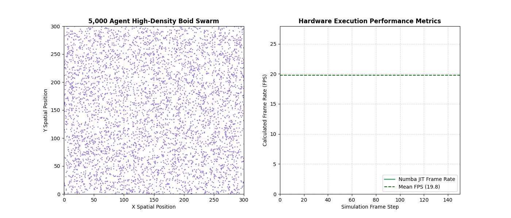
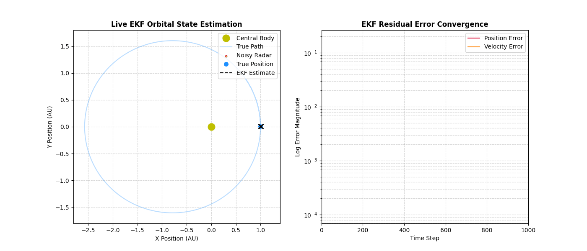
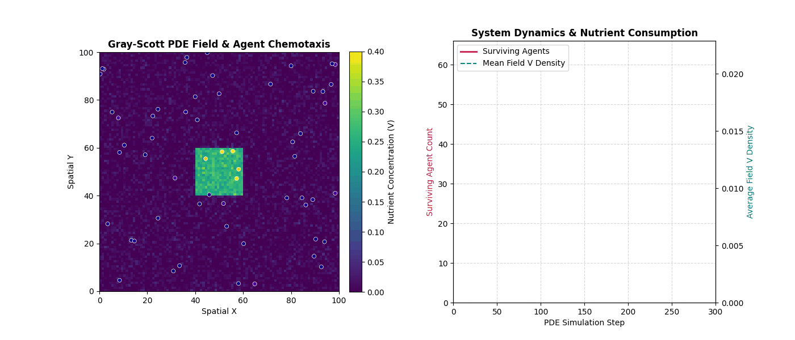
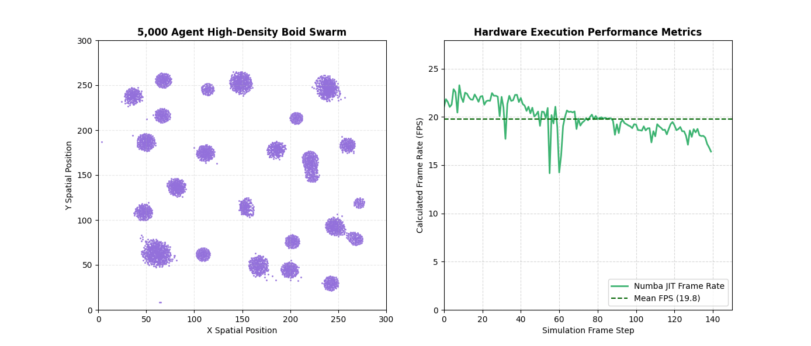
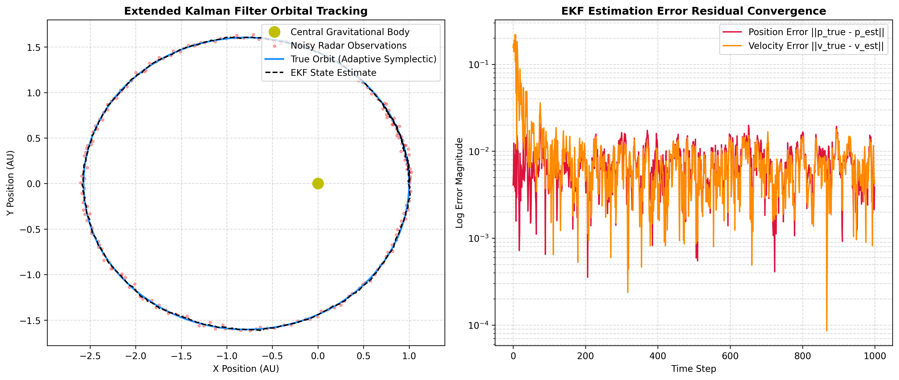

# ⚡ Computational Physics & High-Performance Simulation Suite

[](https://www.python.org/)
[](https://numba.pydata.org/)
[](https://numpy.org/)
[](https://scipy.org/)
[](https://www.kaggle.com/)

## 📖 Overview

This suite features high-performance physics simulations upgraded from baseline implementations into production-grade systems. The focus is on computational acceleration, numerical energy conservation, state estimation under noise, and continuum-discrete field interactions.

The repository highlights three optimized physics paradigms:
- **Spatial Grid Hashing Swarm Engines:** Transitioning naive $O(N^2)$ boid flocking to parallel $O(N)$ JIT execution.
- **Symplectic Orbital State Estimation:** Adaptive Velocity Verlet integration paired with Extended Kalman Filters (EKF).
- **Reaction-Diffusion Morphogenesis:** Continuous Gray-Scott PDE solvers coupled with chemotactic agent navigation.

---

### 🏆 Key Benchmarks & Engineering Achievements

| Physics Module | Baseline Architecture | Upgraded Architecture | Speedup / Metric Impact |
| :--- | :--- | :--- | :--- |
| **Boids Swarm** | Naive $O(N^2)$ CPython Loops (1.0 FPS @ 1,000 agents) | $O(N)$ Spatial Hash Grid + Numba Multi-Threading | **20.7 FPS @ 5,000 agents** (~20× Speedup) 🚀 |
| **Orbits & Gravity** | Fixed-step Explicit Euler (Orbital Energy Drift) | Adaptive Symplectic Verlet + Non-Linear EKF | **Logarithmic Error Convergence** ($\sim 10^{-3}$) 🛰️ |
| **Ecosystem Dynamics** | Discrete Cell Random-Walk | Continuous Gray-Scott PDE ($\nabla^2$) + Gradient Taxis | **Emergent Turing Pattern Chemotaxis** 🧫 |

---

## 💡 Engineering Progressions

### 1. Swarm Intelligence: $O(N^2) \to O(N)$ Spatial Grid Hashing

Naive pairwise distance checks choke modern CPUs at scale. By discretizing the continuous domain into a uniform grid mapped to perception radius ($R_{\text{percept}} = 15.0$), spatial checks are bounded strictly to adjacent $3 \times 3$ grid buckets.



**Key Optimization:** Memory structures were refactored into continuous C-ordered contiguous arrays, enabling multi-threaded CPU SIMD execution via `@njit(parallel=True, fastmath=True)`.

---

### 2. Orbital State Estimation: Adaptive Integration & EKF

Explicit integrators introduce numerical energy drift over multi-orbit cycles. The physics engine was rebuilt around a Velocity Verlet Symplectic Integrator with dynamic time-stepping ($\Delta t \propto \frac{r}{v}$).



State vector estimation ($\mathbf{x} = [p_x, p_y, v_x, v_y]^T$) under polar radar noise ($r, \theta$) is solved using an Extended Kalman Filter linearizing continuous gravitational acceleration via dynamic Jacobian matrices:

$$F_k = \begin{bmatrix} \mathbf{I}_{2\times 2} & \Delta t \cdot \mathbf{I}_{2\times 2} \\ \frac{\partial \mathbf{a}}{\partial \mathbf{p}}\Delta t & \mathbf{I}_{2\times 2} \end{bmatrix}, \quad H_k = \begin{bmatrix} \frac{p_x}{r} & \frac{p_y}{r} & 0 & 0 \\ -\frac{p_y}{r^2} & \frac{p_x}{r^2} & 0 & 0 \end{bmatrix}$$

---

### 3. Ecosystem Morphogenesis: Reaction-Diffusion PDEs

Discrete grid ecosystems fail to model continuous field diffusion. The ecosystem was upgraded to solve non-linear coupled Gray-Scott PDEs using discrete Laplacian operators:

$$\frac{\partial U}{\partial t} = D_u \nabla^2 U - UV^2 + F(1 - U), \quad \frac{\partial V}{\partial t} = D_v \nabla^2 V + UV^2 - (F + k)V$$



Agents navigate the resulting Turing morphogen fields by evaluating continuous spatial concentration gradients ($\nabla V$), balancing metabolic consumption against local resource depletion.

---

## 📊 Performance Analysis

### Boids Spatial Grid Performance


### EKF State Estimation Error Residuals


---

## 🛠️ Technologies Used

- **Languages:** Python 3.8+
- **Accelerated Compute:** Numba (JIT Parallel Execution)
- **Numerical Solvers:** NumPy, SciPy (Signal Convolutions)
- **Visualization:** Matplotlib (FuncAnimation, Telemetry Dashboards)
- **Environments:** Kaggle GPU Notebooks, VS Code

---

## 📁 Project Structure

```text
computational-physics-simulations/
├── images/                  # Animated GIFs and static analytical plots
├── notebooks/               # Interactive Jupyter notebooks for full suite run
├── src/                     # Modularized Python simulation modules
│   ├── boids_numba.py       # Numba JIT Spatial Grid Hash Kernel
│   ├── orbits_ekf.py        # Symplectic Verlet & EKF Matrix Engine
│   └── ecosystem_pde.py     # Reaction-Diffusion PDE & Chemotaxis Module
├── README.md                # Technical Portfolio Documentation
└── requirements.txt         # Project Dependencies
```

## 🚀 How to Run

1. Clone the repository:
   ```bash
   git clone https://github.com/Adnyeus/computational-physics-simulations.git
   cd computational-physics-simulations

2. Install dependencies:
   ```bash
   pip install -r requirements.txt

3. Execute simulation modules directly:
   ```bash
   python -m src.boids_numba

4. Launch interactive notebook:
   ```bash
   jupyter notebook notebooks/computational_physics_suite.ipynb

## 📝 Author
Ebad Naeem
[Github](https://github.com/Adnyeus) | [LinkedIn](https://www.linkedin.com/in/ebad-naeem-7984522b8) | [Portfolio](https://poised-plutonium-331.notion.site/Project-Portfolio-3d1d274aed4c8058a670c2b92fd28d2f)

## 🙏 Acknowledgments
- Kaggle Community for high-performance GPU notebook hosting environments.
